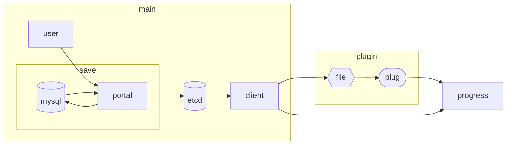

# hillo
搞一个配置中心玩玩

## feature

* [ ] 配置写入
* [ ] 配置同步
* [ ] 客户端
* [ ] docker

## 项目结构

### 规划

```mermaid
graph LR

saveDB[(mysql)]
syncDB[(etcd)]
progress[progress]
conf{{file}}


subgraph main
    user --> portal--> syncDB --> client 
    subgraph save
        portal --> saveDB
        saveDB --> portal
    end
end

subgraph plugin
    client --> conf
    conf --> plug
end

plug([plug]) --> progress
client--> progress


```

